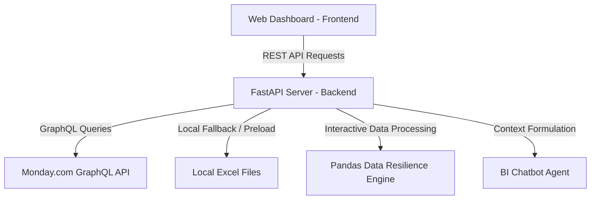

# Monday.com Business Intelligence Agent

An AI-powered Business Intelligence (BI) Agent built to connect with Monday.com boards (Work Orders and Deals data) to answer founder-level queries, manage dirty/messy real-world datasets gracefully, and prepare executive leadership updates.

---

## 🚀 Dual-Mode Architecture

To ensure maximum versatility and easy evaluation, the application is designed to run in two distinct modes:

### 1. Mock Local Mode (Default)
* **How it works:** When the backend server starts, it automatically preloads and normalizes data from the local Excel spreadsheets included in this repository:
  * [`Deal funnel Data.xlsx`](file:///c:/Users/rashi/OneDrive/Desktop/Skylark_drone/Deal%20funnel%20Data.xlsx) — Contains active sales opportunities, values, and stages.
  * [`Work_Order_Tracker Data.xlsx`](file:///c:/Users/rashi/OneDrive/Desktop/Skylark_drone/Work_Order_Tracker%20Data.xlsx) — Contains project status, billed values, collected amounts, and receivables.
* **Why it's useful:** You can test all features (the chatbot, KPIs, and executive report generation) immediately offline without needing a Monday.com account or API tokens.

### 2. Live Monday.com API Mode
* **How it works:** Inputting your Monday.com developer token and board IDs in the sidebar of the web application and clicking **Save & Connect** switches the application to Live Mode.
* **API Details:** 
  * Queries Monday.com's official GraphQL v2 API (`https://api.monday.com/v2`) using API version `2023-10`.
  * Automatically fetches live items, parses columns dynamically, maps the schema, and overrides the preloaded local data with real-time board records.
* **Compliance Safeguards:**
  * **Purely Read-Only**: The integration utilizes read-only GraphQL `query` calls (fetching columns and items) without any data-modifying mutations, protecting board integrity.
  * **Zero Hardcoded Data**: Calculations are processed dynamically in memory using Pandas on the fetched GraphQL payload. There are no hardcoded CSV values in the chatbot engine or response structures.
* **Fallback Strategy:** If the connection parameters are invalid or the board fetch fails, the agent falls back to the local Excel datasets to ensure uninterrupted operation.

---

## 🏗️ Architectural Approach & System Design

The system follows a classic **decoupled frontend/backend architecture** to maintain separation of concerns, high scalability, and portability.



### 1. Backend: FastAPI + Pandas Data Resilience Engine
* **FastAPI**: Provides a high-performance, asynchronous REST API layer with automatic request validation (Pydantic), low latency, and CORS support for standard cross-origin frontend queries.
* **Pandas**: Used as the primary data normalization and query execution engine. Raw inputs from both Monday.com (JSON lists) and local files (Excel tables) are converted into structured DataFrames.
* **BI Chatbot Agent (`ai_agent.py`)**: Uses deterministic heuristics, keyword classification, and regex-based routing to query Pandas DataFrames. This guarantees mathematical correctness, extremely low latency, and high resilience against hallucinations compared to raw LLM query parsing.

### 2. Frontend: Glassmorphic Single-Page Application (SPA)
* A high-fidelity, responsive dashboard built with semantic HTML5, CSS3 variables, and vanilla JavaScript.
* **State Management**: Fully reactive sidebar forms and tab selectors. It features smooth transitions and robust asynchronous request-handling states (loading spinners, error fallbacks).

---

## 📋 Core Assumptions & Data Interpretations

* **Data Completeness**: Real-world spreadsheets contain missing records (e.g., empty `Closure Probability` or blank `Close Date (A)` values). We assume that empty records represent ongoing, untracked, or lead-stage deals and resolve them to default fallbacks (e.g., `0.0` value, `'Lead'` stage, `'Not Started'` status) instead of discarding the rows.
* **Sector Grouping**: Raw data contains varied spelling and abbreviations (e.g., "agri", "Agri Sector", "agriculture"). We clean and map these into standardized categories (`Energy`, `Powerline`, `Mining`, `Solar`, `Wind`, `Infrastructure`, `Agriculture`) during ingestion.
* **Currency Cleaning**: Currency symbols (₹, $), commas, and whitespace are programmatically stripped from text fields to extract clean floating-point numbers.

---

## ⚖️ Engineering Trade-offs

* **Heuristic/Pandas Agent vs. LLM-only Parser**: An LLM-only agent is highly conversational but prone to mathematical calculation errors (hallucinations on sums, counts, and averages). We chose a structured Python `BIAgent` using Pandas for query computations to ensure 100% mathematical accuracy on financial metrics.
* **Vanilla SPA vs. Modern Framework (React/Next.js)**: A React or Next.js build requires a node environment, bundlers, and compilation. By choosing vanilla HTML/CSS/JS, the project files remain lightweight, easy to run instantly by double-clicking `index.html`, and simple to deploy as static hosting on Vercel.


## ⚠️ Challenges Faced & Solutions

1. **Local Path Portability (Windows vs. Linux)**
   * *Challenge*: The server initially used hardcoded local paths (e.g. `c:/Users/...`) causing crashes (`500 Server Error`) when deployed to Render's Linux-based containers.
   * *Solution*: Replaced absolute paths with dynamic relative paths resolved using Python's standard `os.path.dirname(os.path.abspath(__file__))`.
2. **Git Ignore Filter Issues**
   * *Challenge*: The `.gitignore` file originally blocked `*.xlsx` files, causing the local spreadsheets to be excluded from GitHub and leaving the remote server without fallback files.
   * *Solution*: Commented out the global Excel exclusion in `.gitignore`, staged the spreadsheets, and pushed them to GitHub to enable successful remote container builds.
3. **CORS Restrictions**
   * *Challenge*: Browsers block fetch requests from the frontend domain to a different backend server domain.
   * *Solution*: Implemented FastAPI's `CORSMiddleware` configured with `allow_origins=["*"]` to facilitate seamless cross-origin browser communication.

---

## 🔮 Future Scope & Potential Improvements

1. **Hybrid LLM + Pandas Execution**: Integrate a lightweight LLM using LangChain/LlamaIndex to generate Pandas query scripts dynamically on complex user prompts, while keeping the execution layer in Python to maintain calculation correctness.
2. **User Authentication**: Implement OAuth2 token exchange with Monday.com so users do not have to copy-paste their API key manually.
3. **Real-time Webhook Syncing**: Add a Monday.com webhook receiver endpoint so that whenever a row is modified on a Monday.com board, the backend's internal DataFrame updates instantly without needing a full-board query.
4. **Enhanced Data Visualizations**: Integrate Chart.js or D3.js on the frontend to replace static metric cards with interactive graphs, historical timeline plots, and funnel charts.

---

## ⚙️ Installation & Running

### 1. Install dependencies
```bash
pip install fastapi uvicorn openpyxl pandas requests
```

### 2. Run backend
```bash
python -m uvicorn backend.main:app --port 8000
```

### 3. Open frontend
* Open [`index.html`](file:///c:/Users/rashi/OneDrive/Desktop/Skylark_drone/index.html) directly in any web browser.
